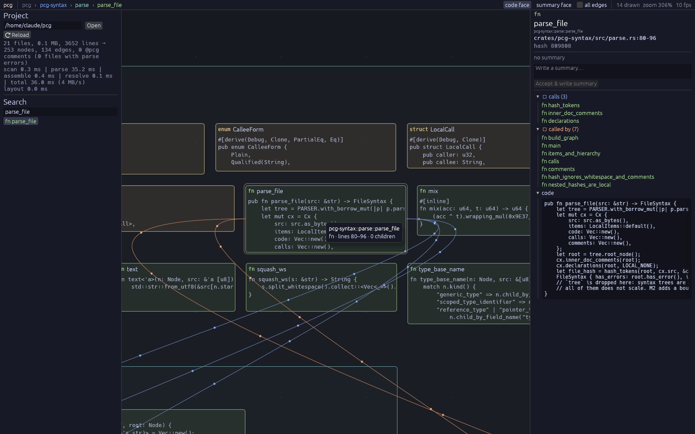
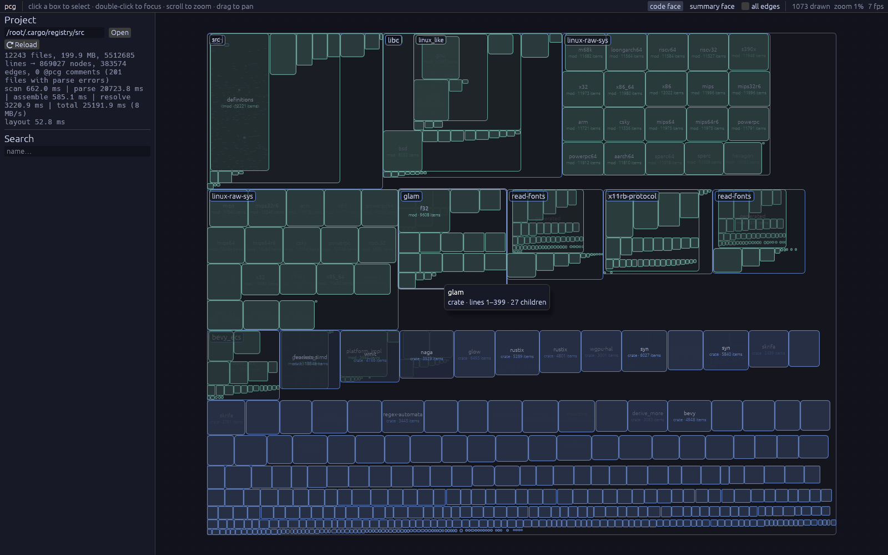
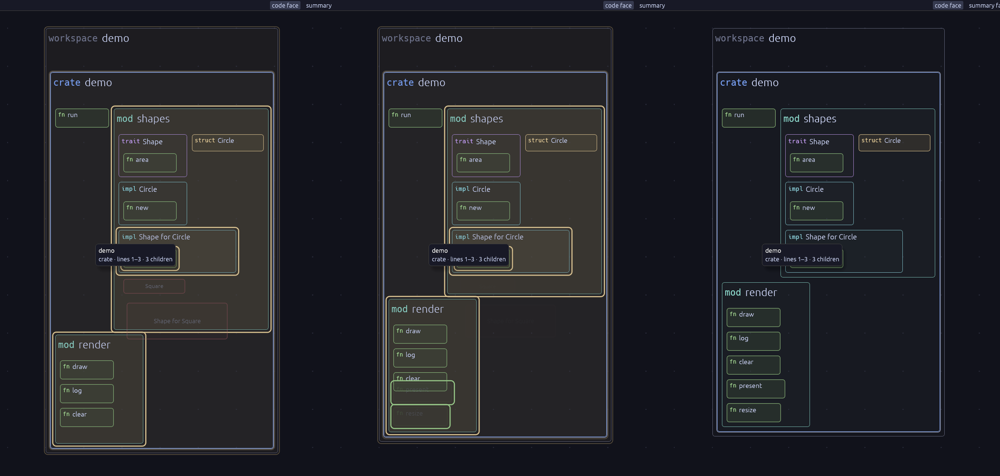

# pcg — a graphical, LLM-ready code editor

A visual IDE (Blueprint-like, but for general-purpose code) written in Rust with
**tree-sitter** and **bevy + bevy_egui**. Text stays the source of truth; the graph
is a projection of it. See the project docs (*vision-and-decisions*,
*roadmap-and-architecture*) for the full design.

**Status: M1 (skeleton & static graph), M2 (incremental reload, animated diff),
M3 (in-node editing), the layered layout with edge routing, and M6 (precise call
edges from rust-analyzer) implemented.**



## Run

```sh
cargo run --release -p pcg-app -- [--no-lsp] <path-to-a-rust-project>   # default: current dir (dogfooding)
cargo run --release -p pcg-syntax --example dump -- <dir> [--tree]   # headless pipeline + timings
cargo run --release -p pcg-syntax --example parse_bench -- <dir>      # tree-sitter vs. extraction cost
cargo run --release -p pcg-syntax --example edit_bench -- <file.rs>   # cost of one keystroke in an open file
cargo run --release -p pcg-layout --example layout_bench -- <dir>     # layout cost, shelf vs. layered
cargo test --workspace
```

First build compiles Bevy (several minutes). `dev` builds use `opt-level = 1` for
our crates and `3` for dependencies, so debug runs are usable.
On Windows the MSVC toolchain is required (tree-sitter compiles C code).
Precise call edges need `rust-analyzer` on the `PATH` (`rustup component add
rust-analyzer`); without it, or with `--no-lsp`, edges are name-based.

### Controls

| input | action |
|---|---|
| wheel / pinch | zoom at cursor (semantic zoom) |
| drag | pan |
| click | select · `Esc` deselect · `Backspace` select parent |
| double-click / `F` | fly to node (`F` with nothing selected: fit all) |
| search box | find by name, click to fly there |
| *code face / summary face* | what leaves show at deep zoom |
| *all edges* | aggregated call graph on the visible boxes |
| `Enter` / inspector → *Edit* | edit the selected node's source in place, syntax-highlighted; any number of editors can be open, also several on one file. The graph follows the unsaved text live (calls, new items, the diff animation); nothing touches the disk until `Ctrl+S` (all files) / *Save*. `Esc` closes the focused editor (asks once before discarding unsaved text). If a file changes on disk under unsaved text, its editors offer *Keep mine* / *Take theirs*. |
| inspector → *Accept & write summary* | writes a `@pcg:summary[h=…]` comment into the file (only on this explicit accept, decision 7) and reloads |
| *(save a file in any editor)* | the project is watched: only changed files are re-parsed, and the graph animates the diff — moved boxes glide, new ones fade in (green), removed ones fade out (red), changed ones glow (yellow). Selection follows the node by identity. |

## Workspace

```
crates/
  pcg-core/    data only: dense ids, interner, SoA tables (nodes, edges, files, @pcg comments)
  pcg-syntax/  stages: scan → parse (rayon, tree-sitter) → assemble → @pcg comments → resolve edges;
               `Buffer` = an open file (text + syntax tree, edit-range reparse)
  pcg-layout/  nested boxes, two linear passes; per container a layered (call-flow) or shelf
               arrangement, plus a route for every edge between or through containers
  pcg-lsp/     rust-analyzer client: where is each call site's callee defined?
  pcg-app/     Bevy shell + egui panels/canvas; resources = data, systems = control flow
```

### Data-oriented core

* **Pre-order node table with `subtree_end`.** Descendants of `n` are the contiguous
  range `n+1..subtree_end[n]`; skipping a subtree is one jump; bottom-up passes
  iterate ids in reverse. No pointers, no recursion — layout, culling and resolution are
  straight loops.
* **SoA everywhere** (`kind`, `name`, `parent`, `bytes`, `lines`, `content_hash`, …),
  edges with CSR adjacency (`out` / `inc`), one contiguous string interner.
* **Stages are pure functions** of tables. The per-file parse stage is embarrassingly
  parallel and produces file-local tables; assembly maps them to global ids serially.
* **Hashing in one token pass:** every non-comment token is hashed once
  (`xxh3(text, seed = kind)`) and folded into the accumulators of all enclosing items,
  so whitespace/comment edits never change a hash and nesting doesn't multiply cost.
* **Canvas cost scales with what is visible,** not project size: the pre-order sweep
  culls off-screen / sub-pixel subtrees in O(1) each. Semantic zoom is continuous —
  children fade in as their parent's on-screen size crosses a threshold, so zooming
  itself animates the level-of-detail change.

### In-node editing

An open file is a `Buffer` — the only place a syntax tree is kept — and each editor
a byte span into it; editors further down the same file shift as one grows. Each keystroke is one minimal edit: `Tree::edit` +
tree-sitter's incremental reparse, then the extraction pass. A quarter second after
the last keystroke the pipeline is re-run with the buffer as an *overlay* that
replaces the file's on-disk text, so the graph is always a projection of what you
see, saved or not. The editor is anchored to the byte span, not to a node id: an
item that is renamed or briefly does not parse is re-found after each rebuild.
Colours are read off the same syntax tree (a walk over the edited span), in the
editor's layouter, so they always belong to the text on screen.

Saving keeps the file's line endings and never clobbers a file that changed on disk
since the editor opened: a clean buffer simply follows the disk (editors re-find
their item by its path of `(kind, name, ordinal)`), a buffer with unsaved text is
marked as in conflict until you keep yours or take theirs.

One keystroke in a 21 kB file costs ~3.5 ms (full parse: ~9 ms); in a 350 kB file
~50 ms (full: ~86 ms). Extraction is still a whole-file pass and now dominates.

### Layout and edge routing

Every edge is lifted to the two siblings below its ends' lowest common ancestor, so
each container sees the call graph *between its children* — functions in a module,
modules in a crate, crates in the workspace. Children with such edges are layered
Sugiyama-style: cycles broken by a DFS, longest-path layers (callers before
callees), a lane reserved in every layer a longer edge crosses, a few barycentre
sweeps against crossings. Layers run left-to-right or top-to-bottom and wrap into
several bands — whichever brings the box closest to the target aspect. The rest is
shelf-packed beside it, as are containers where layering would be lopsided (one
caller of fifty) or too big.

Every such edge gets a route: an orthogonal polyline through the gutters between
layers, along the lanes, and around the band ends — between the boxes, never across
them. Edges that leave or enter a container are collected on a bus (one lane per
layer) ending in a port on the container's side, where the route one level up takes
over. So an edge between two distant functions is drawn level by level — out of its
module, across the crate, into the other module — and shares each stretch with every
other edge going the same way.

This repo: 0.4 ms, root box 1.7:1 (plain layering: 4:1). `~/.cargo/registry/src`
(1.5 M nodes, 840 k edges): 540 ms, 219 k routes; the shelf pass alone is 41 ms.

### Precise call edges (rust-analyzer)

tree-sitter sees *that* `x.len()` is a call, not *which* `len`. So the graph first
appears with name-based edges, and a background thread asks rust-analyzer for the
definition behind every call site (`textDocument/definition` at the callee's name).
When the answers arrive the graph is rebuilt with them: one edge to the real
definition, none for calls into std or dependencies. Sites the server cannot answer
keep the name-based guess; the side panel shows how many were resolved.

The server is given every file's text exactly as the snapshot has it — including
unsaved editor buffers — and answers are only applied to text with the same hash, so
an edit falls back to the guess for that file until the server has been asked again.
It runs with build scripts, proc macros and `cargo check` off: it never builds in
your target directory, and does not see through generated code.

This repo (a Bevy workspace): 3818 of 3884 call sites answered 37 s after start,
333 name-based edges become 557 precise ones.

### `@pcg` comments

```rust
/// @pcg:intent Parse the config file and fall back to defaults on error.
/// @pcg:summary[h=3fa9c1] Reads TOML from path, merges with Default,
///   logs warnings.
fn load_config(path: &Path) -> Config { … }
```

`//!` at the top of a file describes the file module. `h=` is a 24-bit short hash of
the item's code subtree. States: *missing / fresh / stale / unhashed* (dot badge on the
box, colour in the inspector). Writes preserve CRLF and refuse to touch a file that
changed on disk since analysis.

## Measurements (cloud VM, 2 cores)

| input | files | source | nodes | edges | total |
|---|---|---|---|---|---|
| this repo | 21 | 0.1 MB | 253 | 134 | 36 ms |
| `~/.cargo/registry/src` (bevy, wgpu, windows-sys, …) | 12 243 | 200 MB / 5.5 M lines | 869 k | 384 k | 25 s, ~620 MB peak RSS |

The parse stage is ~1.3× raw tree-sitter time
(tree-sitter itself: ~13 MB/s on 2 threads). With the whole registry loaded the canvas
draws only ~1–5 k boxes per frame.





## Known limitations

* **Call edges** are precise only once rust-analyzer has answered, and only as far as
  it sees: with proc macros and build scripts off, calls on types that come out of
  generated code may stay unanswered. Until then, and for those, edges are name-based
  heuristics (free fn / method / `Type::f` / macro, ranked same-file → same-crate →
  global, ambiguous calls dropped, common std method names skipped). Every edit
  re-asks all call sites, not just the changed file's. Calls through a generic bound
  or trait object point at the trait's declaration, not at the impls. Calls inside macro arguments
  (`println!(…f()…)`) are not seen by tree-sitter at all.
* Syntax trees are dropped after extraction (memory), except for the file open in the
  editor. External saves reload per *file* (a parse cache keyed by mtime/size/bytes):
  they give no edit ranges for tree-sitter.
* In-node editing: no completion, no three-way merge (a conflict is all-mine or
  all-theirs), editors of one file may not overlap. Extraction after an edit re-walks
  the whole file, and the live rebuild re-runs assemble + resolve over the whole project.
* Stable node identity is `(parent, kind, name, ordinal)`: renaming an item, or moving
  it to another module, reads as exit + enter, not as a move.
* Layout: a call-graph change can reshuffle a container; layers are centred in their
  band, not aligned to straighten edges; wrapped layouts leave empty corners. Edges
  sharing a gutter or bus are drawn on top of each other (one line, many dots). Where
  a container's layers and its parent's run along different axes, the edge walks
  around the container's corner. Shelf-packed containers have no routes: edges cross
  them as plain curves. The "all edges" overlay draws straight lines.
* Rendering uses egui's painter; GPU instancing / custom WGSL comes with M5.
